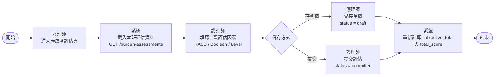
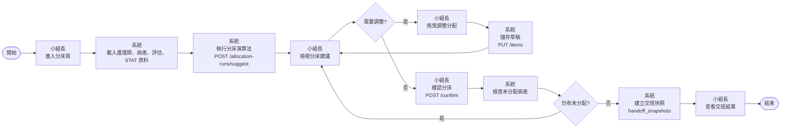
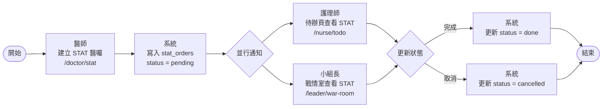

# BPMN 流程圖

系統三條主要業務流程。BPMN 2.0 XML 檔案位於同目錄，可匯入 [bpmn.io](https://bpmn.io) 或 Camunda Modeler 查看與編輯。

| 流程 | XML 檔案 |
|------|----------|
| 麻煩度評估 | [burden_assessment.bpmn](burden_assessment.bpmn) |
| 分床與交班 | [allocation_handover.bpmn](allocation_handover.bpmn) |
| STAT 突發醫囑 | [stat_orders.bpmn](stat_orders.bpmn) |

---

## 流程一：麻煩度評估

> 護理師在班前填寫各自負責病患的主觀麻煩度評估，系統計算 `total_score` 供分床演算法使用。

---

## 流程二：分床與交班

> 小組長在班前產生分床建議、人工調整後確認分床，系統建立交班快照封存當下分配結果。

---

## 流程三：STAT 突發醫囑

> 醫師在班中建立突發醫囑，護理師待辦頁與小組長戰情室即時顯示，使用者可標記完成或取消。

