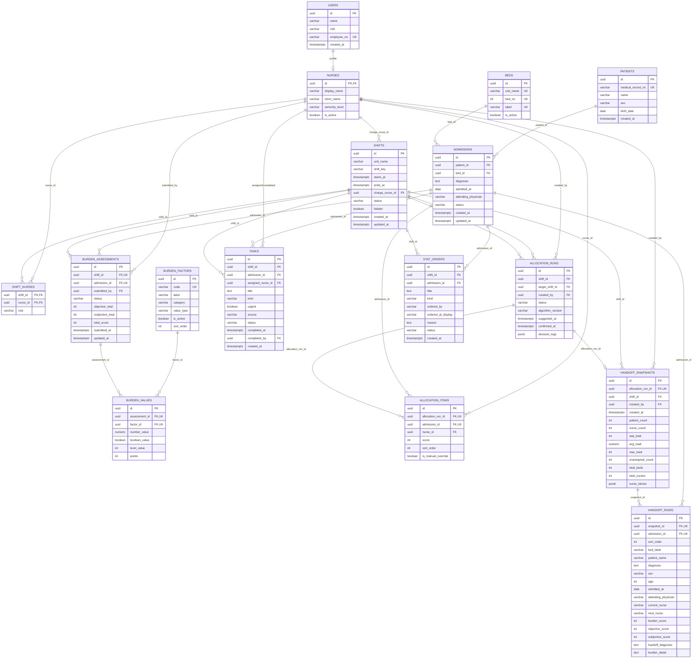
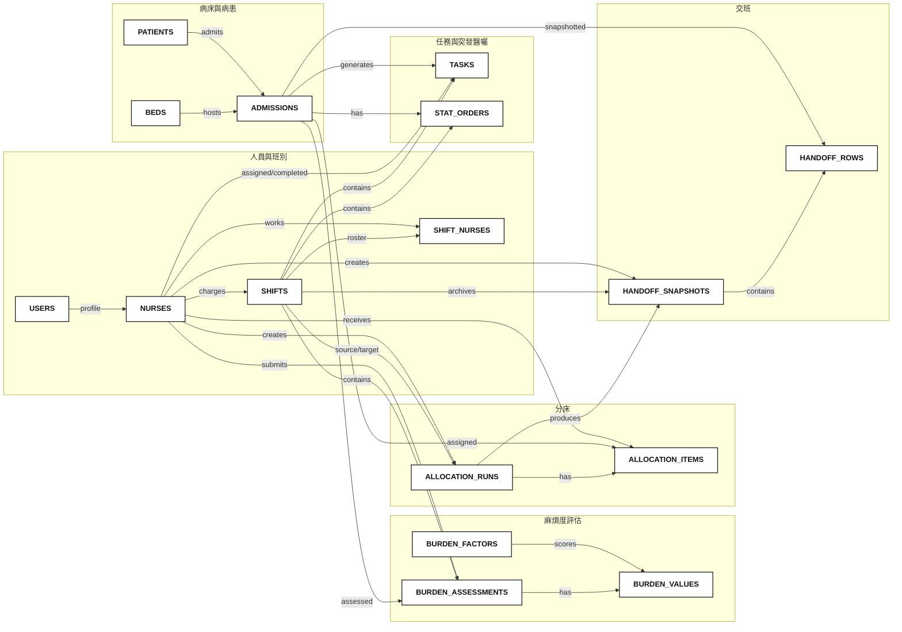

# 08. 後端資料庫 Schema Diagram 與 ER Diagram

本文件依據目前後端部署使用的 PostgreSQL schema 產生，來源為 `backend/db/migrations/001` 至 `006`。資料庫支援 ICU 護理分配決策系統的班別、人員、病床、病患入院、麻煩度評估、任務、分床、STAT 醫囑與交班快照。

`Schema Diagram` 用來呈現實際資料表、欄位、PK/FK/UK 與資料型別；`ER Diagram` 用來呈現業務概念中的 entity 與 relationship，方便說明系統如何串起照護流程。

## 系統模組

| 模組 | 主要資料表 | 說明 |
| :--- | :--- | :--- |
| 人員與班別 | `users`, `nurses`, `shifts`, `shift_nurses` | 使用者、護理師資料、班別與班別出勤名單 |
| 病床與病患 | `beds`, `patients`, `admissions` | ICU 病床、病患主檔、住院/床位紀錄 |
| 麻煩度與任務 | `burden_factors`, `burden_assessments`, `burden_values`, `tasks` | 客觀/主觀麻煩度評估與護理任務 |
| 分床 | `allocation_runs`, `allocation_items` | 分床建議批次與每位病患分配結果 |
| 突發醫囑 | `stat_orders` | STAT/突發醫囑事件 |
| 交班 | `handoff_snapshots`, `handoff_rows` | 已確認分床後產生的交班快照與列資料 |

## Schema Diagram

## ER Diagram

## 關鍵關係說明

| 關係 | Cardinality | 說明 |
| :--- | :--- | :--- |
| `users` → `nurses` | 1 → 0..1 | 護理師是使用者的一種 profile，`nurses.id` 同時也是 `users.id` |
| `shifts` ↔ `nurses` | M ↔ N | 透過 `shift_nurses` 表達班別出勤名單 |
| `beds` → `admissions` | 1 → N | 同一病床可有歷史入院紀錄，但 active 狀態每床只允許一筆 |
| `patients` → `admissions` | 1 → N | 同一病患可有多次入院紀錄 |
| `burden_assessments` → `burden_values` | 1 → N | 一份麻煩度評估包含多個 factor value |
| `allocation_runs` → `allocation_items` | 1 → N | 一次分床建議產生多筆病患-護理師分配 |
| `allocation_runs` → `handoff_snapshots` | 1 → 0..1 | 每次已確認分床最多產生一份交班快照 |
| `handoff_snapshots` → `handoff_rows` | 1 → N | 快照保存當下交班列資料，包含冗餘文字欄位以利歷史追溯 |

## 設計重點

- `allocation_runs.decision_logs` 和 `handoff_snapshots.nurse_blocks` 使用 `jsonb` 保存演算法決策與交班展示區塊，屬於刻意反正規化，方便保留當下狀態。
- `handoff_rows` 保存床號、病患姓名、診斷、護理師名稱等文字快照，即使原始病患或護理師資料日後異動，歷史交班內容仍可重現。
- `burden_assessments` 以 `(shift_id, admission_id)` 做唯一限制，代表同一班別對同一入院病患只會有一份麻煩度評估。
- `allocation_items` 以 `(allocation_run_id, admission_id)` 做唯一限制，代表同一次分床中同一病患只會被分配一次。
- `stat_orders` 與 `tasks` 都掛在 `shift_id` 和 `admission_id` 下，但用途不同：`stat_orders` 表示突發醫囑事件，`tasks` 表示護理待辦工作。
